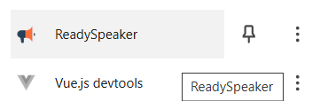

# Introduction

Bienvenue dans ce tutoriel consacré à la présentation du processus de conception
d'un système de lecteur vocal texte-parole en HTML, CSS, JS pour Chrome.

Création d'une extension Chrome

* Nous créons le fichier (mainfest.json) pour éditer la description et la configuration de l'extension.

// manifest.json
```
{
  "manifest_version": 3,
  "name": "ReadySpeaker",
  "description": "Système de lecteur vocal de texte-parole",
  "version": "1.0",
  "action": {
    "default_popup": "popup.html"
  },
  "icons": {
    "48": "img/icon-48.png"
  }
}
```

* Nous ajoutons le fichier (hello_extensions.png) qui représente l'icône de l'extension.

// Fichier (Icône Extension)
```
img/icon-48.png
```

* Nous créons le fichier (popup.html) pour éditer la fenêtre pop-up de l'extension.

// popup.html
```
<html>
  <body>
    <h1>Fenêtre popup de l'extension...</h1>
  </body>
</html>
```

* Nous chargeons l'extension dans le navigateur (Chrome).

// Chrome (Extensions)
```
chrome://extensions
Cocher > Mode développeur
Charger l'extension non empaquetée
Dossier > v01 > Sélectionner un dossier
``` 


* Nous affichons la fenêtre pop-up de l'extension dans le navigateur (Chrome).

// Chrome (Extensions)
```
chrome://extensions
Extension > ReadySpeaker
``` 




